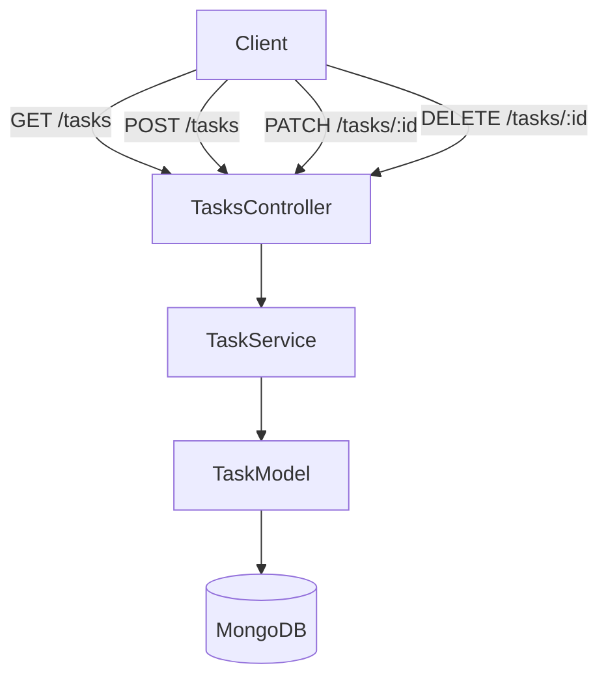

# Developer Documentation

The Task Manager Webapp follows a MERN architecture (MongoDB, Express.js, React, Node.js), separating responsibilities between the frontend, backend and the database.

## 1. Project Architecture

### Overview

```css
[ React (Frontend)] <-> [Express API (Backend)] <-> [MongoDB Database]
```

the following diagram shows the flow of CRUD requests from the client to the database.



The controllers handle HTTP requests, which delegate business logic to services. Models manage persistence in MongoDB. On the frontend, pages provide container views, components handle UI, services call the API, and utils contain shared logic.

#### Frontend (React + Vite)

- Provides the user interface.
- Handles displaying tasks, forms for creating/updating tasks, and state management.
- Communicates with the backend through Axios to perform API requests.

#### Backend (Node.js + Express)

- Exposes a REST API for tasks.
- Contains routing, validation, and error handling.
- Uses Mongoose models to interact with MongoDB.
  
#### Database (MongoDB)

- Stores tasks as documents in a collection.
- Mongoose enforces schema validation (title, description, status, due date).

### Design Considerations

#### Separation of concerns

Business logic is isolated in controllers, database access in models and the UI in react.

#### Scalability

The modular folder structure makes it easy to add new features (for example user accounts).

#### Error Handling

Centralised middleware handles validation and API errors consistently.

#### Test Driven Development

Where possible a test driven approach has been applied to create robust functional code.

#### Naming Conventions

Following standard JavaScript naming convention, camelCase has been used on variables and functions, PascalCase for classes and files.
  
### Folder Structure

#### Backend Folder Structure

Contains the Express server, task logic and Mongoose database models.

``` text
Backend/
├── config/
│   └── Config.js
├── controllers/
│   └── Task.Controller.js
├── db/
│   └── Database.js
├── models/
│   └── Task.model.js
├── routes/
│   └── Task.Routes.js
├── server/
│   └── Server.js
├── services/
│   └── Task.Service.js
├── test/
│   └── integration/
│       └── Task.test.js
├── .env
├── .env.dev
├── .env.test
├── index.js
└── package.json
```

#### Documentation

Markdown documentation, images and supporting files

``` text
Docs/
├── images/
├── api.md
├── developer.md
├── testing.md
└── userStories.md
```

#### Frontend Folder Structure

React + Vite application, with components, pages, Axios services and utility functions

```text
frontend/
└── DTS-frontend
    ├── src/
    │   ├── components/
    │   │   ├── Header.jsx
    │   │   ├── TaskLine.jsx
    │   │   └── TaskTable.jsx
    │   ├── pages/
    │   │   ├── Task.jsx
    │   │   └── Tasks.jsx
    │   ├── services/
    │   │   ├── Tasks.API.js
    │   │   └── Tasks.Services.js
    │   ├── utils/
    │   │   ├── Tasks.Tools.js
    │   │   └── TaskStatus.Tool.js
    │   ├── App.css
    │   ├── App.jsx
    │   ├── index.css
    │   └── main.jsx
    ├── test/
    │   ├── data/
    │   │   └── data.json
    │   └── unit/
    │       ├── Tasks.API.test.js
    │       ├── Tasks.Services.test.js
    │       ├── Tasks.Tools.test.js
    │       └── TaskStatus.Tool.test.js
    ├── .env
    ├── .env.development
    ├── .env.test
    ├── index.html
    ├── package.json
    └── vite.config.js
```

### Entry Points

Backend Entry point: backend/index.js  
Frontend Entry point: frontend/DTS-frontend/main.jsx

## 2. Testing

A more detailed explanation can be found in [testing.md](./testing.md).

### Backend Testing

#### Technologies used for the backend testing

The backend tests are implemented using:

- **Mocha** - test runner
- **Chai** - assertion library
- **Supertest** - for HTTP integration testing
- **C8** - code coverage
- **MongoDB** - test database or mocked

These were applied following a Test Driven Development (TDD) approach to ensure the API layer is robust and reliable.

#### Running the backend tests

##### 1. Run all tests:-

```bash
npm test
```

##### 2. Generate a coverage report:-

```bash
npm run coverage
```

The coverage report will be output to the backend/coverage folder.
